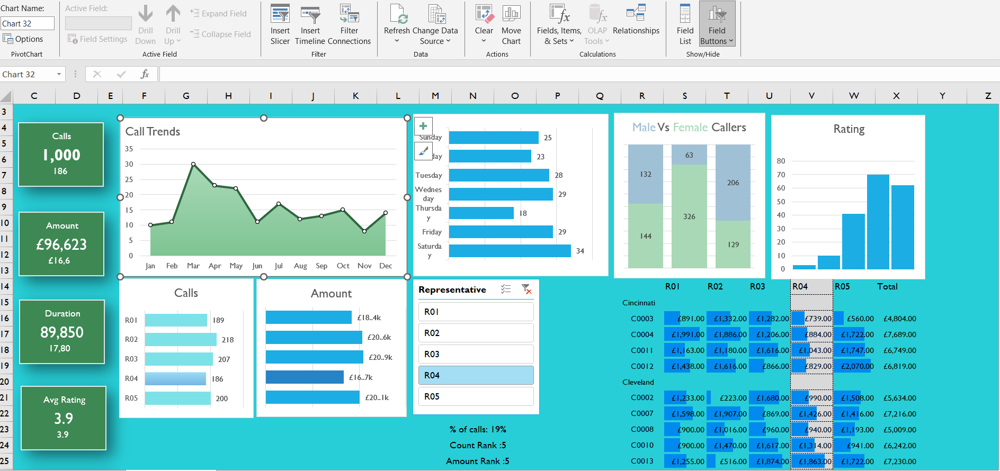

The repository contains excel files demonstrating various Excel formulas and analysis concepts
Formulas and methods included:
Pivot table
count
countif
sum
sumif
sumifs
min
max
average
if
and
or
mean
mode
median
mode
frequency
iferror
vlookup
macro
VBA
Moving Averages

1. Simple Moving Average
2. Cummulative Moving Average
3. Exponential Moving Average

Excel Report - Call Center Calls analysis by representatives
---DAX, Pivot Tables, Charts and Formulas (data-excel-portfolio.xlsx)

